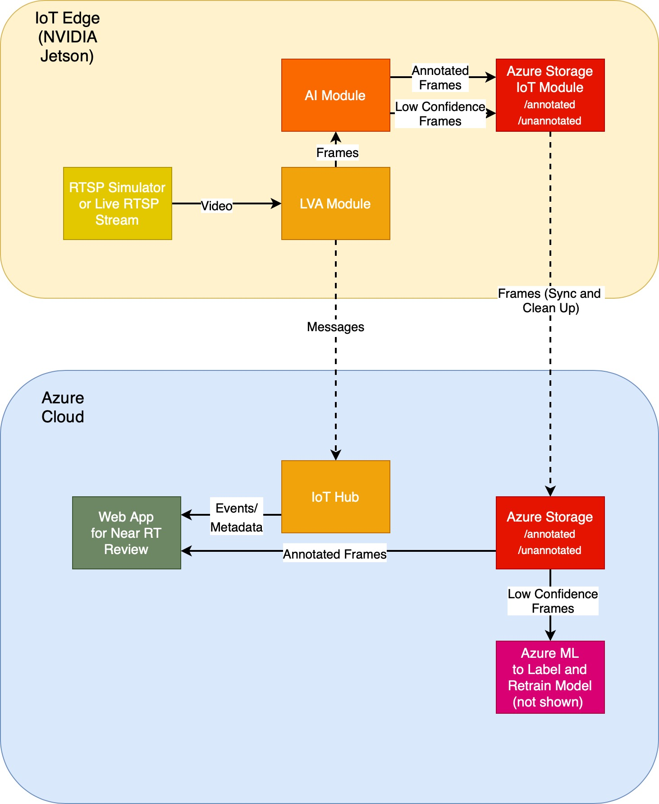
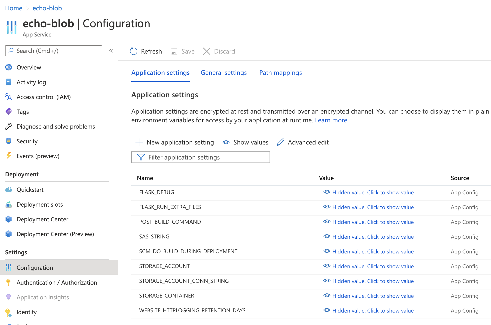
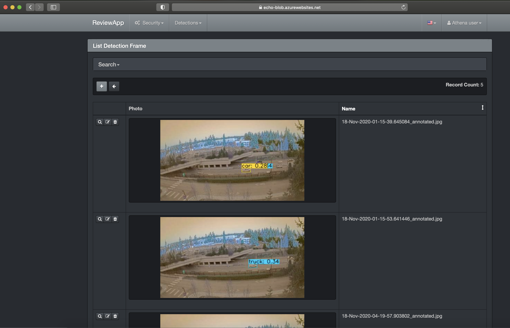

# Tiny YOLOv4 TensorFlow Lite model on Jetson Xavier with Azure Blob Storage and Live Video Analytics

This repo is an example of running an AI container on the Jetson platform in conjunction with the [Azure Blob Storage IoT Edge module](https://docs.microsoft.com/en-us/azure/iot-edge/how-to-store-data-blob?view=iotedge-2018-06) using the [Live Video Analytics](https://docs.microsoft.com/en-us/azure/media-services/live-video-analytics-edge/) as a platform ontop of [Azure IoT Edge](https://docs.microsoft.com/en-us/azure/iot-edge/?view=iotedge-2018-06) runtime.

The purpose of this architecture is to create a pipeline that can route video (frame-by-frame) into an AI module for inferencing on the edge (image classification, object detection, etc.) that, in turn, stores output frames in a Blob Storage IoT Edge module storage container (a storage container, here, is a unit of storage within the Blob Edge module).  The Blob Storage IoT storage container or set of containers essentially replicate to the Azure cloud (using some tunable user settings), to Azure Blob Storage, given internet connectivity (or stores on the edge until connectivity is achieved).  

In the diagram below, frames from an AI module are shown being sent on the edge to two storage containers in the Blob Edge module:  1) for highly confident detection frames and 2) for the more poorly scoring detections (an indication that objects might not be being detected well by the ML model).  Poorly performing frames from the AI edge module are good candidates for labeling and retraining the vision ML model to boost performance, thus have their own container, "unannotaed".  Once the frames are replicated in the cloud in Azure Blob Storage, [Azure Machine Learning](https://docs.microsoft.com/en-us/azure/machine-learning/) may be used to label and retrain the ML model.  The confident, annotated frames in the "annotated" conatiner could be reviewed, for instance, within an Azure Web App (code not provided, here).



This AI module (docker container) utilizes the GPU on the Jetson (with NVIDIA drivers, CUDA and cuDNN installed) using an NVIDIA L4T (linux for Tegra) base image with TensorFlow 2 installed.  The Jetson must have been flashed with Jetpack 4.4.

## Outline

- [Xavier Setup and requirements](#xavier-setup-and-requirements)
- [Azure requirements](#azure-requirements)
- [Build docker AI image](#build-docker-ai-image)
- [Deploy as an edge module for Live Video Analytics](#deploy-as-an-edge-module-for-live-video-analytics)
- [Flask Python web app dashboard](#flask-python-web-app-dashboard)
- [Troubleshooting](#troubleshooting)
- [Additional resources](#additional-resources)

## Xavier Setup and requirements

- Flashed with JetPack 4.4 (L4T R32.4.3) with all ML and CV tools (including `nvidia-docker`)
- Samsung NVMe to store docker images and serve as location for Blob Storage data
- 16 GB swap file on NVMe mount
- [Azure CLI](https://docs.microsoft.com/en-us/cli/azure/install-azure-cli-apt#manual-install-instructions) for pushing image to Azure Container Registry
- [Optional] Docker may be configured to run with non-root user as in [Manage Docker as a non-root user](https://docs.docker.com/engine/install/linux-postinstall/#manage-docker-as-a-non-root-user) allowing the omission of using `sudo` with docker
- As Azure IoT Edge device (will need Azure IoT Hub for this)

## Azure requirements

Create the following resources:

1. [Azure Storage Account](https://docs.microsoft.com/en-us/azure/storage/common/storage-account-create?tabs=azure-portal)
2. [Azure Container Registry](https://docs.microsoft.com/en-us/azure/container-registry/container-registry-get-started-portal)
3. [Azure IoT Hub](https://docs.microsoft.com/en-us/azure/iot-hub/iot-hub-create-through-portal)
4. [Azure Media Services Account](https://docs.microsoft.com/en-us/azure/media-services/latest/create-account-howto?tabs=portal)

Note:  All of these resources should be created in the same resource group to make it easier to clean-up later.  Also, all of these resources may be create in the Portal _or_ with the Azure CLI on the command line.

## Build docker AI image

The following instructions will enable you to build a docker container with a [YOLOv4 (tiny)](https://github.com//AlexeyAB/darknet) [TensorFlow Lite](https://www.tensorflow.org/lite) model using [nginx](https://www.nginx.com/), [gunicorn](https://gunicorn.org/), [flask](https://github.com/pallets/flask), and [runit](http://smarden.org/runit/).  The app code is based on the [tensorflow-yolov4-tflite](https://github.com/hunglc007/tensorflow-yolov4-tflite) project.  This project uses TensorFlow v2.

Note: References to third-party software in this repo are for informational and convenience purposes only. Microsoft does not endorse nor provide rights for the third-party software. For more information on third-party software please see the links provided above.

### Prerequisites for building image

1. [Ensure NVIDIA Docker](https://github.com/NVIDIA/nvidia-docker/wiki/NVIDIA-Container-Runtime-on-Jetson) on your Jetson
2. [Install curl](http://curl.haxx.se/)
3. [Install Azure CLI](https://docs.microsoft.com/en-us/cli/azure/install-azure-cli-apt) to be able to push image to Azure Container Registry (ACR)

### Preparing for using Blob Storage on the Edge

1. You will need to create a local key for the Blob Edge module.  Generate the _local_ storage key with the `scripts/generate_key_for_local.py` or a tool like [GeneratePlus](https://generate.plus/en/base64).
2. Create a file in the `app/` folder called `.env` with the following contents:

```
LOCAL_STORAGE_ACCOUNT_NAME=<Name for local blob storage in IoT edge Blob Storage module (default: annotatedimageslocal)>
LOCAL_STORAGE_ACCOUNT_KEY=<Key you generated for local IoT edge Blob Storage module in double quotes>
```

Note:
- After the Edge deployment outlined below, two containers will be created in Azure Blob Storage:
    - `annotated-images-yolo4`
    - `lowconf-images-yolo4`
- Refer to [Deploy the Azure Blob Storage on IoT Edge module to your device](https://docs.microsoft.com/en-us/azure/iot-edge/how-to-deploy-blob?view=iotedge-2018-06) for general information

### Building the docker container

1. Create a new directory on your machine and copy all the files (including the sub-folders) from this GitHub repo to that directory.
2. Build the container image (will take several minutes) by running the following docker command from a terminal window in that directory.  Use your ACR URL (i.e. <my ACR user>.azurecr.io) as part of the tag in the command below to make it easier to push to this ACR.

```bash
sudo nvidia-docker build . -t <your ACR URL>/tiny-yolov4-tflite:arm64v8-cuda-cudnn -f arm64v8-gpu-cudnn.dockerfile
```

### Upload docker image to Azure Container Registry

Log in to ACR with the Azure CLI (also may use docker login):

```
az acr login --name <name of your ACR user>
```

Push the image to ACR:

```
docker push <your ACR URL>/tiny-yolov4-tflite:arm64v8-cuda-cudnn
```

Note:
- More instruction at [Push and Pull Docker images - Azure Container Registry](http://docs.microsoft.com/en-us/azure/container-registry/container-registry-get-started-docker-cli) to save your image for later use on another machine.
- IMPORTANT:  Docker may need to be configured to run with non-root user as in [Manage Docker as a non-root user](https://docs.docker.com/engine/install/linux-postinstall/#manage-docker-as-a-non-root-user).

## Deploy as an edge module for Live Video Analytics

Visual Studio Code (VSCode) will be used for the following.  The following will be needed:

1. Azure IoT Tools extension installed (search in VSCode for this)
2. Deployment manifest file from this repo (`edge-module/deployment.yolov4.gpu.jetson.blob.template.json`)
3. [LVA Python console app](https://github.com/Azure-Samples/live-video-analytics-iot-edge-python) or [LVA .NET console app](https://github.com/Azure-Samples/live-video-analytics-iot-edge-csharp)
4. IDs and keys associated with Azure Resources

When the Live Video Analytics on Edge direct methods are invoked (through the LVA console app) on device with the console app, images will appear in a folder with the name of your local container e.g. `/media/nvme/blob_storage/BlockBlob/annotatedimageslocal` and with default deployment manifest, will stick around on device for 60 minutes as well as being uploaded to the cloud Blob Storage container (in this example, called `annotated-images-yolo4`).

Steps:
1.  Associate the device with IoT Hub if haven't already
2.  Create a `.env` parameters file within the `edge-module` folder with the following contents:

```
SUBSCRIPTION_ID_FOR_AMS=<Azure subscription associated with the AMS account>
RESOURCE_GROUP_FOR_AMS=<Resource Group where the AMS account resides>
AMS_ACCOUNT=<AMS account name>
IOTHUB_CONNECTION_STRING="<IoT Hub connection string>"
AAD_TENANT_ID=<Active Directory tenant ID>
AAD_SERVICE_PRINCIPAL_ID=<Active Directory Service Principal ID>
AAD_SERVICE_PRINCIPAL_SECRET="<Service Principal secret/key>"
INPUT_VIDEO_FOLDER_ON_DEVICE="<input video folder on device for the media server>"
OUTPUT_VIDEO_FOLDER_ON_DEVICE="<output video folder on device to sink video clips from LVA>"
OUTPUT_BLOB_FOLDER_ON_DEVICE="<output folder for Blob Storage data>"
APPDATA_FOLDER_ON_DEVICE="/var/lib/azuremediaservices"
CONTAINER_REGISTRY_USERNAME_myacr=<ACR username>
CONTAINER_REGISTRY_PASSWORD_myacr=<ACR key>
CLOUD_STORAGE_CONN_STRING="<Azure Blob Storage cloud connection string>"
LOCAL_STORAGE_ACCOUNT_NAME="<local Edge Storage account name>"
LOCAL_STORAGE_ACCOUNT_KEY="<local Edge Storage account key>"
```

These variables, from the `.env`, will be automatically populated into the IoT Edge deployment manifest file after a deployment manifest file is generated from the template.

3. [Generate the deployment manifest and deploy with VSCode](https://docs.microsoft.com/en-us/azure/iot-edge/how-to-deploy-modules-vscode?view=iotedge-2018-06) or the [Azure CLI](https://docs.microsoft.com/en-us/azure/iot-edge/how-to-deploy-modules-cli?view=iotedge-2018-06)
4. Run the LVA console app (Python or .NET)
5. Monitor the device for messages from VSCode

From VSCode, messages to IoT Hub should look similar to:
```
[IoTHubMonitor] [1:11:41 PM] Message received from [xavier-yolov4/lvaEdge]:
{
  "inferences": [
    {
      "type": "entity",
      "entity": {
        "tag": {
          "value": "car",
          "confidence": "0.43346554"
        },
        "box": {
          "l": "0.6137574",
          "t": "0.5797131",
          "w": "0.05888599",
          "h": "0.047415733"
        }
      }
    },
    {
      "type": "entity",
      "entity": {
        "tag": {
          "value": "truck",
          "confidence": "0.33760804"
        },
        "box": {
          "l": "0.6137574",
          "t": "0.5797131",
          "w": "0.05888599",
          "h": "0.047415733"
        }
      }
    }
  ]
}
```

Notes:
- Learn more about Edge deployments with [Understand IoT Edge automatic deployments for single devices or at scale](https://docs.microsoft.com/en-us/azure/iot-edge/module-deployment-monitoring?view=iotedge-2018-06)
- Review LVA through the guide [Quickstart: Get started - Live Video Analytics on IoT Edge](https://docs.microsoft.com/en-us/azure/media-services/live-video-analytics-edge/get-started-detect-motion-emit-events-quickstart)

## Flask Python web app dashboard

### Requirments

1. Python 3.6+

### Get started

1. Navigate to the `web-app` directory.

2. Create your environment variables as show in the example below and load them into the current terminal session.

e.g. create a `.vars` file for unix systems as in:
```
export SAS_STRING="?sv=..."
export STORAGE_ACCOUNT="storage account name"
export STORAGE_CONTAINER="private image container name"
export STORAGE_ACCOUNT_CONN_STRING="DefaultEndpointsProtocol=https;AccountName=..."
```

Load these variables on a unix system with:
```
source .vars
```

On Windows in the command prompt, each environment variables can be set with the following lines:
```
set SAS_STRING "?sv=..."
set STORAGE_ACCOUNT "storage account name"
set STORAGE_CONTAINER "private image container name"
set STORAGE_ACCOUNT_CONN_STRING "DefaultEndpointsProtocol=https;AccountName=..."
```


3. Install the requirements into a dedicated [conda environment](https://docs.conda.io/projects/conda/en/latest/user-guide/tasks/manage-environments.html) or [virtual environment with `venv`](https://docs.python.org/3/library/venv.html) (both are a best practice) with:
```
# Create a conda env or virtual env first, then...
pip install -r requirements.txt
```

You will then need to activate the environment.

4. Run the app with the following:

```
python run.py
```

Then, navigate in your browser to http://127.0.0.1:8080/ to see the web app running locally.

### Deploy the web app to Azure as an App Service

You can deploy the Flask-based Python web app from the `web-app` folder with the Azure CLI as shown in [Quickstart: Create a Python app in Azure App Service on Linux](https://docs.microsoft.com/en-us/azure/app-service/quickstart-python?tabs=bash&pivots=python-framework-flask).  You will need to set the same environment variables in the `.vars` file within the **Settings --> Configuration** blade in the Azure Portal under the App Service resource:



The final web app with look something like:



## Troubleshooting

### Troubleshooting a running container

To troubleshoot a running container you may enter it with ssh by using the following command.

```
sudo docker exec -it my_yolo_container /bin/bash
```

For IoT Edge troubleshooting see [Troubleshoot your IoT Edge device](https://docs.microsoft.com/en-us/azure/iot-edge/troubleshoot).

### Azure Media Services

1.  If AMS account has changed, then on device delete and recreate the App Data Directory for AMS:
```
sudo rm -fr /var/lib/azuremediaservices
mdkir -p /var/lib/azuremediaservices
```
   - It is a good idea to then restart lvaEdge module
   ```
   iotedge restart lvaEdge
   ```

### Azure Blob Storage IoT Edge module

1. Check the logs for Permission denied errors for folder on device used as container.
```
iotedge logs <name of your edge container e.g. azureblobstorageoniotedge>
```
   - If there is a "Permission denied" error try changing the owner and group on the folder (see [Granting directory access to container user on Linux](https://docs.microsoft.com/en-us/azure/iot-edge/how-to-store-data-blob?view=iotedge-2018-06#granting-directory-access-to-container-user-on-linux)).
   ```
   sudo chown -R 11000:11000 <local blob directory e.g. /media/nvme/blob_storage>
   ```
   - It is a good idea to then restart lvaEdge module
   ```
   iotedge restart lvaEdge
   ```

### Keys

Put keys and connection strings in quotes within the files like `.env` and `.vars`.

## Additional resources

- [`darknet` implementation for YOLOv4](https://github.com/AlexeyAB/darknet)
- [TensorFlow YOLOv4 converters and implementations](https://github.com/hunglc007/tensorflow-yolov4-tflite)
- [Flask-AppBuilder for basis of web app](https://github.com/dpgaspar/Flask-AppBuilder)
